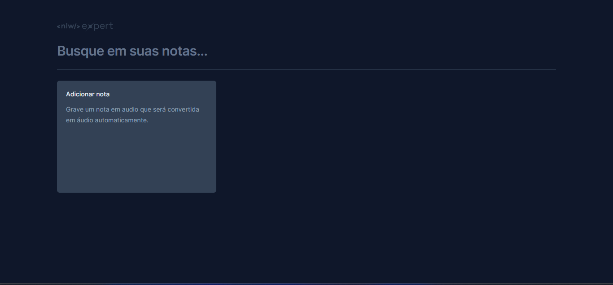
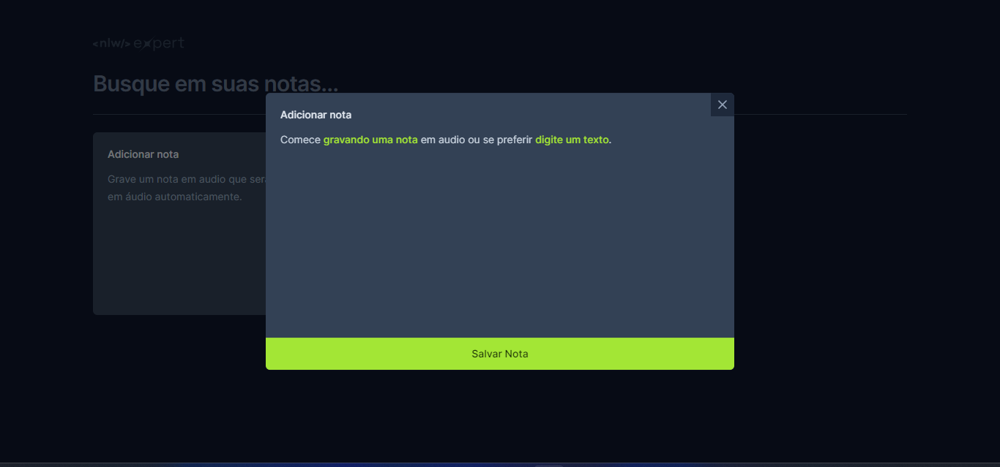

# Bloco de notas

<p align="center">
   
  
</p>


Aplicação desenvolvido com React durante a NLW da Rocketseat.

## Tecnologias usadas

- Tailwind 
- SpeechRecognition API
- Vite
- Typescript

## Rodando projeto 

Após clonar basta rodar os seguintes comandos:

```console
npm install
npm run dev
```

E pronto! A aplicação estará rodando em [http://localhost:5173/](http://localhost:5173/)